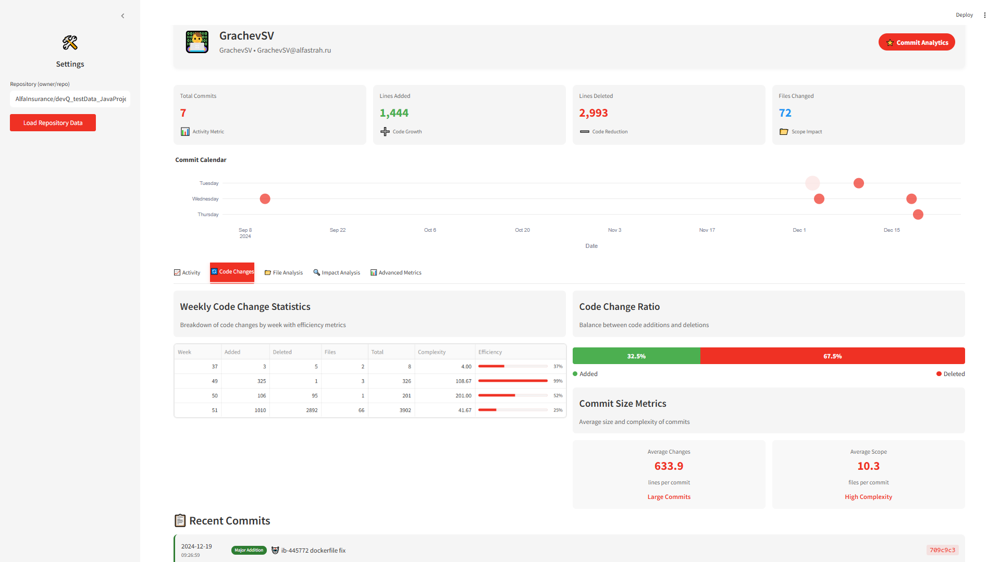
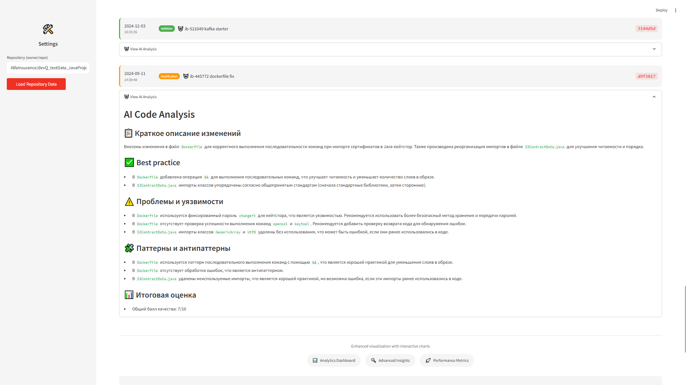

# Code quality reported | LLM Coding Challenge & Кейс АльфаСтрахование

### Обзор проекта
Code Quality Reporter – это AI-ассистент для анализа качества кода разработчиков на основе их прошлых коммитов в GitHub репозиториях.
В рамках MVP можно получить детальную аналитику активности выбранного разработчика за нужный период времени, увидеть оценку качества кода по каждому из pull-реквестов и выгрузить общий PDF-отчет.






### Стек
- Frontend: Streamlit
- Backend: Python
- Анализ данных и визуализация: Pandas, Plotly
- Интеграция с GitHub: PyGithub
- AI/LLM: Интеграция с различными LLM для анализа кода (Yandex Foundation Models / OpenRouter)

### Структура проекта
```
code-quality-reporter/
├── streamlit_app.py        
├── requirements.txt                          
├── app/
│   ├── models/             
│   │   └── llm_service.py            # Сервис для работы с LLM
│   └── services/           
│       ├── git_service.py            # Сервис для работы с GitHub API
│       ├── visualization_service.py  # Сервис для визуализации данных
│       └── full_quality_report.py    # Генерация полных отчетов о качестве
└── README.md                         # Документация проекта
```

### Установка и локальный запуск

Base requirements:
- Python 3.9+
- GitHub токен для доступа к API

1) Clone repo
```
git clone https://github.com/your-username/code-quality-reporter.git
cd code-quality-reporter
```

2) Create and activate venv
```
python -m venv venv
source venv/bin/activate  # Linux/MacOS
venv\Scripts\activate     # Windows
```

3) Install needed requirements
```
pip install -r requirements.txt
```

4) Create `.env` file and and your `GITHUB_TOKEN`

```
GITHUB_TOKEN=your_github_token_here
```

5) Run app and enjoy
```
streamlit run streamlit_app.py
```


